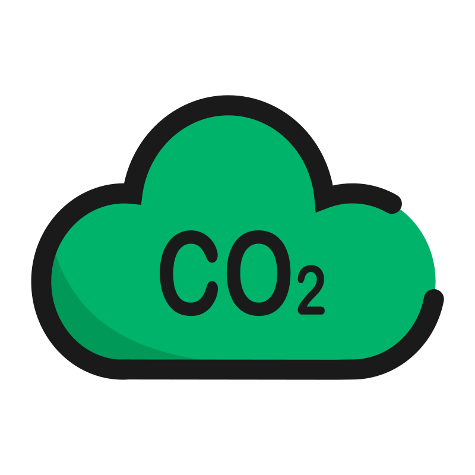
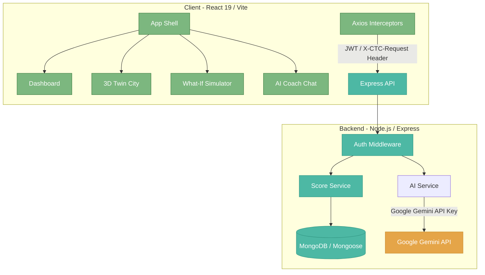

<div align="center">
  

  # 🌍 Carbon Twin City

  > Track, visualize, and reduce your carbon footprint through a personalized 3D avatar and a shared community city.

  [](https://nodejs.org)
  [](https://react.dev)
  [](https://vite.dev)
  [](https://tailwindcss.com)
  [](https://choosealicense.com/)

  [Key Features](#-key-features) • [Tech Stack](#%EF%B8%8F-tech-stack) • [Architecture](#%EF%B8%8F-architecture) • [Getting Started](#-getting-started) • [API Reference](#-api-endpoints) • [Contributing](#-contributing)
</div>

---

## 🚀 Key Features

*   **📊 Personal Carbon Dashboard:** A real-time hub tracking your annual carbon footprint, consecutive log streaks, and weekly emission savings.
*   **🎮 3D Twin City:** An interactive 3D virtual world rendered via Three.js (React Three Fiber) where each skyscraper represents a real community member. Building heights map directly to each user's carbon footprint, with wind turbines, solar panels, and warning beacons dynamically reflecting their individual environmental impact. Hovering over any building displays a sleek, glassmorphic tooltip with live user metrics.
*   **🤖 AI Coach:** Personalized, actionable tips generated dynamically by the Google Gemini API to target your highest emission areas.
*   **📝 Daily Action Logger:** Quick-log eco-conscious daily routines (diet, travel, home energy, and shopping) and witness instant score feedback.
*   **🧪 What-If Simulator:** A scenario testing laboratory projecting potential carbon savings before committing to lifestyle modifications.
*   **🏆 Community Leaderboard:** Friendly competition rankings tracking weekly carbon reduction achievements and top streaks.
*   **📋 Personalized Onboarding:** An interactive baseline quiz analyzing lifestyle habits to calibrate initial footprints.

---

## 🛠️ Tech Stack

### Client (Frontend)
*   **React 19 & Vite 8:** Next-generation rendering speeds and Hot Module Replacement (HMR).
*   **React Three Fiber (R3F) & Drei:** WebGL-based Three.js rendering for the 3D twin avatar and community city.
*   **Tailwind CSS v4 & Framer Motion:** Modern utility-first styling combined with fluent transition micro-animations.
*   **Recharts:** Beautiful, responsive SVG charts tracking score progressions.
*   **React Router v7:** Modern, declaratively styled application shell routing.

### Server (Backend)
*   **Node.js & Express 4:** Fast, minimalist backend web framework.
*   **MongoDB & Mongoose 8:** Document-based database configuration supporting indexed performance lookups.
*   **Google Gemini SDK:** Dynamic, prompt-engineered AI coaching and insight synthesis.
*   **JWT & Bcryptjs:** Stateless authentication architecture utilizing secure, HttpOnly, SameSite-secured token cookies.

---

## 🖥️ Architecture



---

## 🚦 Getting Started

### Prerequisites

Verify that Node.js (v18+) and MongoDB are installed on your environment:
```bash
node --version
npm --version
mongod --version # If running a local DB
```

### Installation

1. **Clone the repository:**
   ```bash
   git clone <repository-url>
   cd carbon-twin-city
   ```

2. **Install all workspace dependencies:**
   This command installs node packages for the **Root**, **Server**, and **Client** directories concurrently:
   ```bash
   npm run install:all
   ```

3. **Configure Environment Variables:**
   Copy the template environment file in the `server` directory:
   ```bash
   cp server/.env.example server/.env
   ```
   Open `server/.env` and update configuration secrets:
   ```env
   PORT=5000
   MONGO_URI=mongodb://localhost:27017/carbon-twin-city
   JWT_SECRET=your_super_secure_jwt_secret
   GEMINI_API_KEY=your_gemini_api_key_from_google_ai_studio
   CLIENT_URL=http://localhost:5173
   ```

4. **Seed Database (Optional):**
   Seed your database collections with mock users, metrics, and logs for immediate testing:
   ```bash
   npm run seed
   ```

5. **Start Development Servers:**
   Launch both backend (port 5000) and frontend (port 5173) in watch mode:
   ```bash
   npm run dev
   ```

---

## 🧪 Testing

Automated test suites utilize **Jest** for API routes/services and **Vitest** + **React Testing Library** for components.

Run all tests from the root directory:
```bash
npm test          # Run all frontend & backend tests
npm run test:server # Run API endpoint and logic tests
npm run test:client # Run React UI component and calculator tests
```

---

## 🌐 Deployment Architecture

Carbon Twin City is optimized for cross-origin cloud hosting configurations:

*   **Frontend**: Hosted on **Vercel** (serving production and preview subdomains like `https://*.vercel.app`).
*   **Backend**: Deployed on **AWS** (such as Elastic Beanstalk, EC2, or ECS).
*   **NGINX Reverse Proxy**: Positioned in front of the actual Express application process (running on port `5000`) on AWS to handle:
    *   SSL/TLS termination (handling incoming secure HTTPS requests).
    *   Proxying traffic securely to the Node.js application process.
    *   Header forwarding (attaching `X-Forwarded-For` and `X-Forwarded-Proto`).
*   **Express Proxy Trust**: The backend configuration includes `app.set('trust proxy', 1)` to trust NGINX headers, ensuring correct IP resolution and cookie transmission over HTTPS.
*   **Cross-Origin Cookie & CSRF Security**: In production, token and CSRF session cookies utilize `sameSite: 'none'` and `secure: true`. To bypass browser restrictions preventing the Vercel frontend from reading the AWS-owned secure cookie, the API returns the CSRF token in response bodies during login, registration, and profile fetching. The client caches this token in-memory and attaches it via the `X-CTC-Request` header on mutating requests (POST, PUT, DELETE).
*   **Dynamic CORS Mapping**: The CORS configuration parses comma-separated allowed origins and supports wildcard matches (e.g. `https://*.vercel.app`) to dynamically support Vercel preview environments out of the box.

---

## 🔌 API Endpoints

All backend routes are prefixed with `/api`. Modifying endpoints require the `X-CTC-Request: true` header for CSRF protection.

| Method | Endpoint | Auth | Description |
| :--- | :--- | :---: | :--- |
| `POST` | `/api/auth/register` | ✗ | Create a new user profile & issue token cookie |
| `POST` | `/api/auth/login` | ✗ | Login credentials validation |
| `POST` | `/api/auth/logout` | ✗ | Clear token session cookie |
| `GET` | `/api/user/profile` | ✓ | Retrieve authenticated profile |
| `PUT` | `/api/user/profile` | ✓ | Update name, city, or location details |
| `GET` | `/api/actions/history` | ✓ | Fetch action logs history (default: 7 days) |
| `GET` | `/api/actions/summary` | ✓ | Fetch weekly action totals and category delta sums |
| `POST` | `/api/actions/log` | ✓ | Log a new eco-action (Diet, Travel, Home, Shopping) |
| `POST` | `/api/quiz/submit` | ✓ | Submit onboarding survey to compute baseline |
| `POST` | `/api/ai/coach` | ✓ | Chat dynamically with Gemini Carbon Coach |
| `GET` | `/api/community/stats` | ✓ | Retrieve aggregate community stats and the user list for 3D city mapping |
| `GET` | `/api/community/leaderboard`| ✓ | Retrieve top reducers and streak achievers |
| `POST` | `/api/simulator/calculate` | ✓ | Run projections on modified lifestyle answers |

---

## 🤝 Contributing

We welcome contributions to help improve Carbon Twin City! To contribute:

1. **Fork** the repository and create your feature branch:
   ```bash
   git checkout -b feat/your-awesome-feature
   ```
2. Follow our commit naming convention (based on Angular Commit Guidelines):
   - `feat: add carbon badges`
   - `fix: resolve auth cookie crash`
   - `docs: update deployment links`
3. Commit and push your changes:
   ```bash
   git commit -m "feat: your descriptive commit message"
   git push origin feat/your-awesome-feature
   ```
4. Open a **Pull Request** explaining your implementation details.

---

## 📄 License

MIT License
